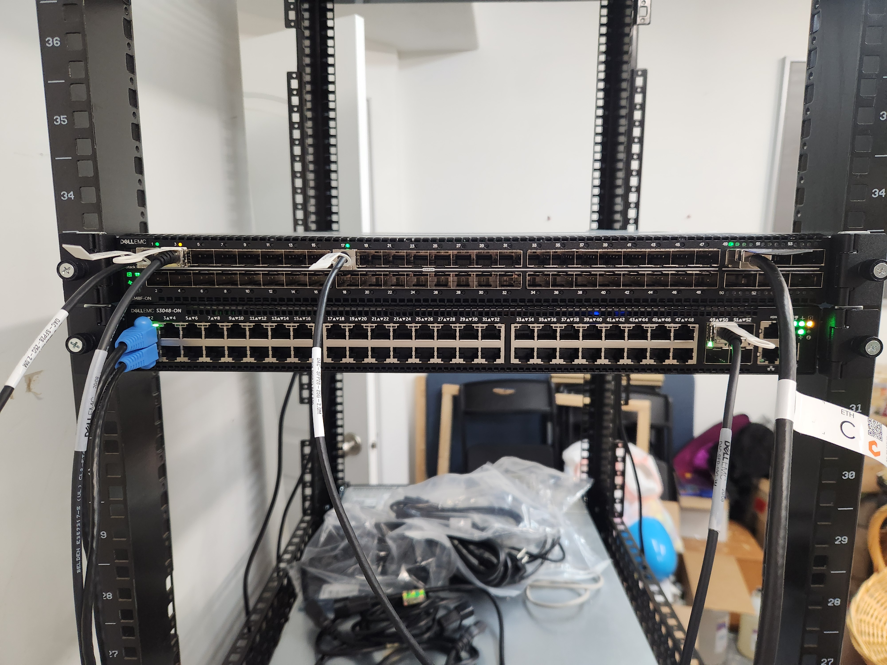

# Switch Config
I was tired of having to configure these switches with dumb command line tools, so I wrote this.
See L3 routing examples in examples/L3.yaml, or L2 in examples/L2.yaml.
If you want, you can add a generator for your own switch type in generators/.
I might add more NOS in the future if I try them out.

## OpenSwitch OPX Installation
This tool works for both OpenSwitch 2.x and 3.x.
If you are using a Dell S5148F-ON, you'll want to use a 2.x version because 3.x has issues with mac learning.

To install, run:
```
sudo /bin/bash -c "$(curl -fsSL https://raw.githubusercontent.com/garet90/switch-config/refs/heads/main/platforms/opx/install.sh)"
```

## My Configuration
I run a Dell S5148F-ON for 10/25/40/100GbE and a Dell S3048-ON for 10/100/1000M with an OPNSense firewall.

`examples/L3.yaml` runs on my S5148F-ON so it acts as my router, only sending internet traffic out.

`examples/L2.yaml` runs on my S3048-ON so it acts as an L2 switch (the IP is for management & so the switch can access the internet).

The OPNSense firewall has `10.211.2.2/16` as its LAN so using it as the next hop for all VLANs works like in my example.


